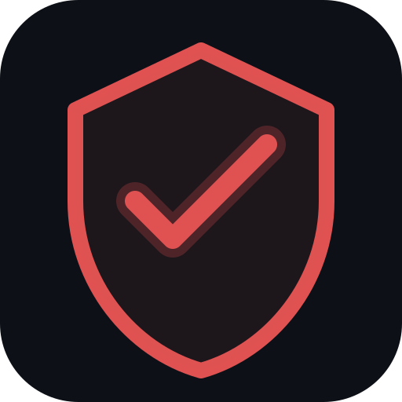
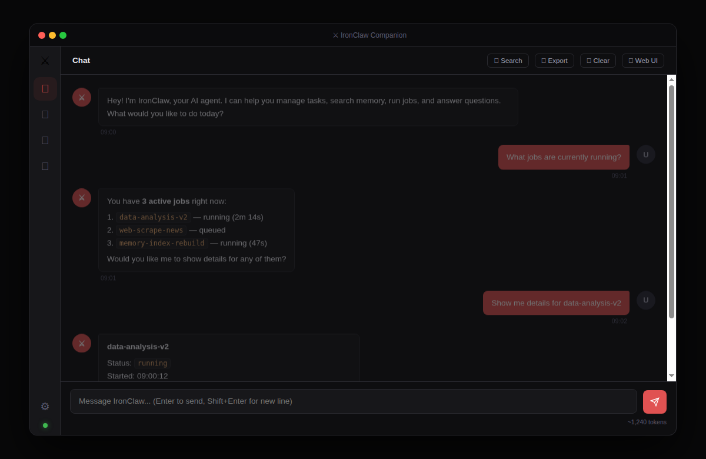
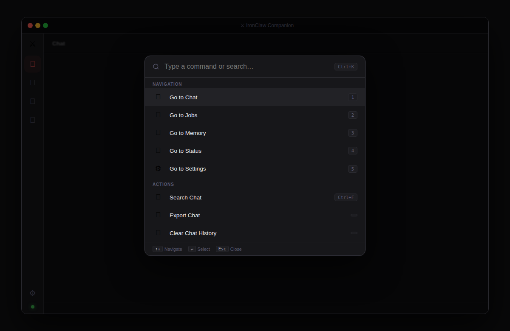
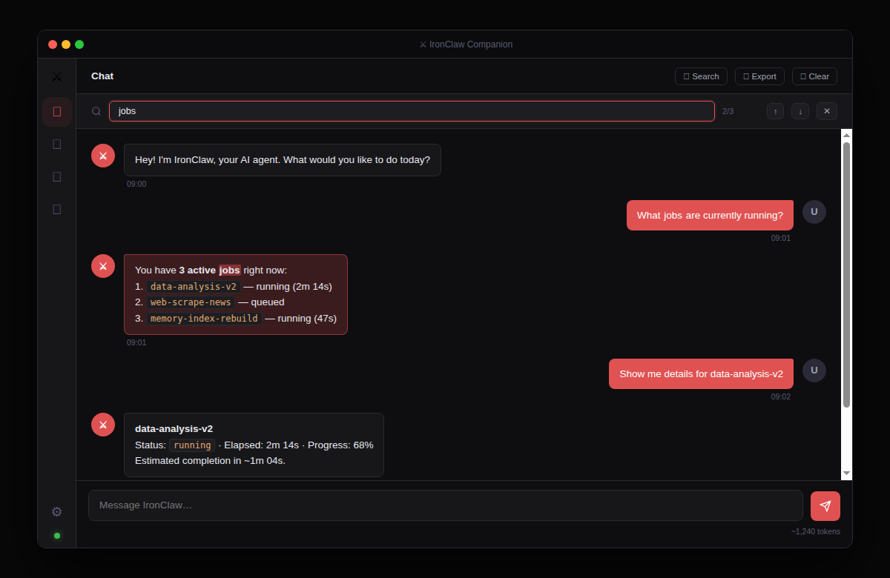
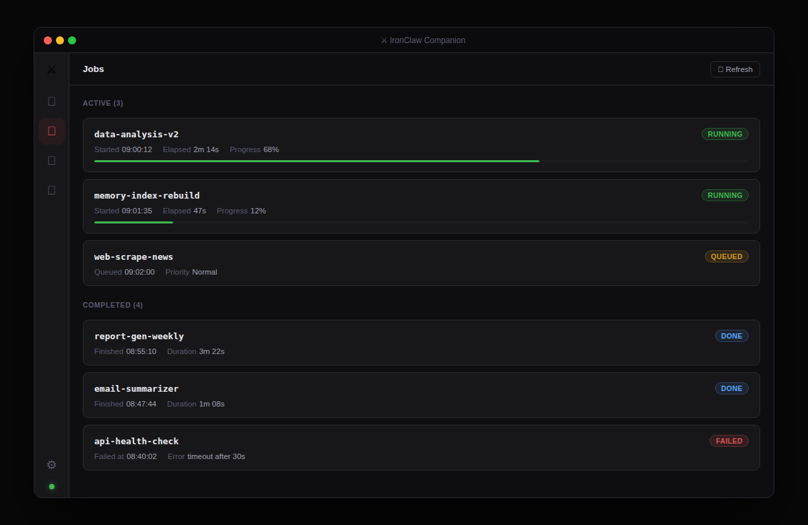
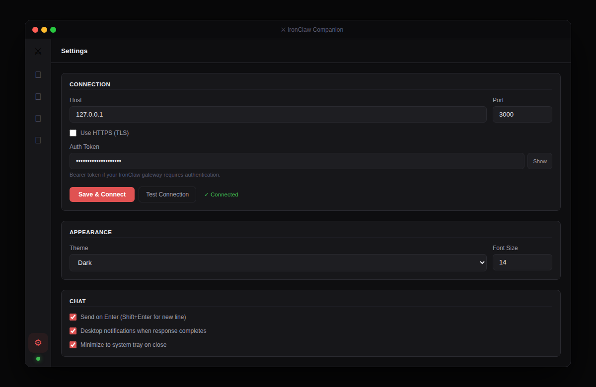

<div align="center">



# IronClaw Companion

**A secure, privacy-first desktop companion for IronClaw AI Agent**

Built with Electron · Runs locally · Zero cloud dependency

[](https://github.com/ddlpng/ironclaw-companion/releases/latest)
[](#-download)
[](LICENSE)
[](SECURITY.md)
[](CONTRIBUTING.md)

</div>

---

## 📸 Screenshots

<div align="center">

**Chat — streaming responses, copy button, token counter**


**Ctrl+K Command Palette — navigate anything from the keyboard**


**Ctrl+F Chat Search — highlight matches, navigate with ↑↓**


**Jobs Dashboard — live progress bars, status badges**


**Settings — full gateway config, theme, chat preferences**


</div>

---

## What is this?

IronClaw Companion is a native desktop app that connects to your **local IronClaw Web Gateway** and gives you a polished interface to chat with your AI agent, monitor jobs, search memory, and track connection status — all without a browser, without a cloud account, and without your data leaving your machine.

---

## ✨ Features

| | Feature | Description |
|---|---|---|
| 💬 | **Streaming chat** | Real-time responses via SSE — watch the agent think character by character |
| 📤 | **Export chat** | Download any conversation as a `.md` file |
| 📋 | **Copy button** | Hover any message bubble → copy to clipboard in one click |
| 🔍 | **Chat search** | `Ctrl+F` → search bar with highlighted matches and ↑↓ navigation |
| ⌨️ | **Command palette** | `Ctrl+K` → navigate tabs, export, search, refresh — fully keyboard-driven |
| 📝 | **Prompt templates** | Quick-access template picker inside the message input |
| 🔢 | **Token counter** | Live ~token estimate for your conversation context |
| 🗑️ | **Clear with confirmation** | Confirmation dialog before wiping history — no more accidental clears |
| 💾 | **Persistent history** | Chat survives restarts — up to 200 messages, saved automatically |
| ✨ | **Markdown rendering** | Bold, `code`, lists, and fenced code blocks render properly |
| 📊 | **Jobs dashboard** | View active and completed agent tasks at a glance |
| 🧠 | **Memory search** | Query your agent's knowledge base directly |
| 🔌 | **Smart reconnect** | Exponential backoff reconnect — polite to your gateway when it's down |
| 🌙 | **Dark / Light theme** | System-native, switches cleanly |
| 🔔 | **System tray** | Minimize to tray, desktop notifications |
| ⚙️ | **Full settings** | Host, port, auth token, HTTPS, font size — all configurable |

---

## 📥 Download

→ **[Releases page](https://github.com/ddlpng/ironclaw-companion/releases/latest)**

| Platform | File | Notes |
|---|---|---|
| 🪟 **Windows** | `IronClaw Companion 1.2.1.exe` | Portable — no install, just double-click |
| 🐧 **Linux** (any) | `IronClaw Companion-1.2.1.AppImage` | No install — `chmod +x` then run |
| 🐧 **Linux** (Debian/Ubuntu) | `ironclaw-companion_1.2.1_amd64.deb` | `sudo dpkg -i` |

> **Latest: v1.2.1** — Security patch (9 IPC hardening fixes). See [Changelog](#-changelog).
> Previous: v1.2.0 — 8 new features including export, copy, search, Ctrl+K palette.

---

## 🚀 Quick Start

### Windows — Portable

1. Download `IronClaw Companion 1.2.0.exe`
2. Double-click — no installation required
3. Open **Settings** → enter your gateway host/port → **Save**

### Linux — AppImage

```bash
chmod +x "IronClaw Companion-1.2.0.AppImage"
./"IronClaw Companion-1.2.0.AppImage"
```

### Linux — .deb

```bash
sudo dpkg -i ironclaw-companion_1.2.0_amd64.deb
ironclaw-companion
```

---

## ⚙️ Configuration

Go to **Settings** (⚙️ in the sidebar):

| Field | Default | Description |
|---|---|---|
| **Host** | `127.0.0.1` | IronClaw gateway hostname or IP |
| **Port** | `3000` | Gateway port |
| **Auth Token** | *(empty)* | Bearer token if your gateway requires auth |
| **Use HTTPS** | Off | Enable for TLS connections |
| **Font size** | `14` | UI font size (px) |
| **Send on Enter** | On | Off = Shift+Enter sends, Enter adds newline |

Hit **Save & Connect** — the app reconnects immediately.

---

## ⌨️ Keyboard Shortcuts

| Shortcut | Action |
|---|---|
| `Ctrl+K` | Open command palette |
| `Ctrl+F` | Search chat messages |
| `Enter` | Send message (configurable) |
| `Shift+Enter` | New line in message input |
| `Esc` | Close search bar / palette |
| `↑` / `↓` | Navigate search results or palette |

---

## 🔒 Security

Built with security as a first-class concern. Every release passes `npm audit` with **0 vulnerabilities**.

> Full security policy and vulnerability disclosure: [SECURITY.md](SECURITY.md)

| Protection | Implementation |
|---|---|
| **XSS Prevention** | All text HTML-escaped before render; code blocks extracted to safe placeholders first |
| **IPC Sender Validation** | Every IPC handler verifies `event.sender === mainWindow.webContents` |
| **Rate Limiting** | Token-bucket: max 1 stream/sec, max 5 memory searches/10s |
| **Stream ID Enforcement** | `stream_\d+` regex validated on both preload and main |
| **Buffer & Size Caps** | 10 MB HTTP cap · 8 MB SSE cap · 128 KB per-line guard |
| **Host Validation** | `0.0.0.0` blocked · hostname regex enforced · token max 2048 chars |
| **Store Hardening** | Prototype pollution protection · key max 128 chars · value max 512 KB |
| **URL Injection** | `openExternal` allows only `http://` and `https://` |
| **Auth Token Safety** | Token sent via `Authorization: Bearer` header — never in URL |
| **Renderer Sandbox** | `sandbox: true` — full Chromium process sandbox |
| **Content Security Policy** | `default-src 'none'`, `connect-src 'none'`, `object-src 'none'`, `base-uri 'none'` |
| **Atomic Config Writes** | Temp file + rename — no corruption on crash · mode `0o600` (owner-only) |
| **Memory Caps** | Chat history capped at 200 messages · `formatMessage` capped at 200 KB |
| **Timer Safety** | GC timers use `.unref()` · `isDestroyed()` guard before every IPC send |

---

## 🛠️ Build from Source

**Requirements:** Node.js 18+, npm 9+

```bash
git clone https://github.com/ddlpng/ironclaw-companion.git
cd ironclaw-companion
npm install

# Development (hot reload)
npm run dev

# Production builds
npm run build:win     # Windows portable exe
npm run build:linux   # AppImage + .deb
npm run build:mac     # macOS .dmg
```

---

## 📁 Project Structure

```
ironclaw-companion/
├── src/
│   ├── main.js          # Electron main process — IPC, streaming, tray
│   ├── preload.js       # Secure IPC bridge (contextBridge)
│   ├── store.js         # Atomic JSON persistence
│   └── renderer/
│       ├── index.html   # App shell
│       ├── app.js       # UI logic — chat, search, palette, templates
│       └── styles.css   # Styles (dark/light, components)
├── assets/              # Icons (SVG, PNG, ICO)
└── package.json
```

---

## 📋 Changelog

### v1.2.1 — Security Patch *(2026-06-06)*

**9 IPC hardening fixes** (no new features, no behavior changes for normal use):

- 🔒 **IPC sender validation** — added missing `event.sender` guard to `get-config`, `api-status`, `api-jobs`, `open-web-gateway`, `open-external`, `set-connection`, `get-app-version`
- 🔒 **isDestroyed() guard** — fixed potential IPC send to destroyed window on app shutdown
- 🔒 **Job status class injection** — whitelisted job status CSS classes to prevent injection
- 🔒 **Job data length caps** — title/ID/date now length-capped against malicious gateway data
- 🔒 **Score validation** — memory relevance score clamped to [0,1]; NaN/Infinity rejected
- 🔒 **Stream chunk guard** — client-side 65KB chunk cap added (defense-in-depth)
- 🔒 **Error sanitization** — stream error messages now sanitized before display
- 🔒 **Export anchor fix** — `exportChat()` DOM insertion fixed for reliable downloads
- 🔒 **Variable shadow fix** — `path` variable renamed to avoid shadowing Node.js `path` module

---

### v1.2.0 — Power User Features *(2026-06-06)*

**8 new features shipped:**

- 📤 **Export chat** — download conversation as `.md` with timestamps
- 📋 **Copy button** — hover any bubble → 1-click copy
- 🔍 **Chat search** — `Ctrl+F`, highlight matches, ↑↓ navigation
- ⌨️ **Command palette** — `Ctrl+K` for everything: tabs, search, export, refresh
- 📝 **Prompt templates** — 6 built-in templates via quick picker in input
- 🔢 **Token counter** — live ~token estimate, warns at 60k / 100k
- 🗑️ **Clear confirmation** — dialog before clearing history
- 🔄 **Exponential backoff reconnect** — 4s → 8s → 16s → 32s → 60s when gateway is down

---

### v1.1.0 — Chat History + Markdown *(2026-06-06)*

- 💾 **Persistent chat history** — conversations survive restarts, auto-saved (500ms debounce), capped at 200 messages
- ✨ **Markdown rendering** — bold, `inline code`, bullet lists, and fenced code blocks
- Timestamps stored with every message
- Full security hardening (rate limiting, IPC validation, size caps, store hardening)

---

### v1.0.0 — Initial Release *(2026-06-01)*

- Real-time streaming chat (SSE)
- Jobs dashboard, memory search, status monitor
- Dark/Light theme, system tray, desktop notifications
- Atomic config persistence, full XSS prevention

---

## 🤝 Contributing

Contributions are welcome! Read [CONTRIBUTING.md](CONTRIBUTING.md) to get started.

For deep dives into the internals, see [DEVELOPMENT.md](DEVELOPMENT.md).

Bug reports, feature requests, and questions: use [GitHub Issues](https://github.com/ddlpng/ironclaw-companion/issues) — templates provided.

---

## 🤝 Related

- [IronClaw](https://github.com/nearai/ironclaw) — The AI Agent this app connects to

---

<div align="center">

Made with ⚔️ · MIT License

</div>
